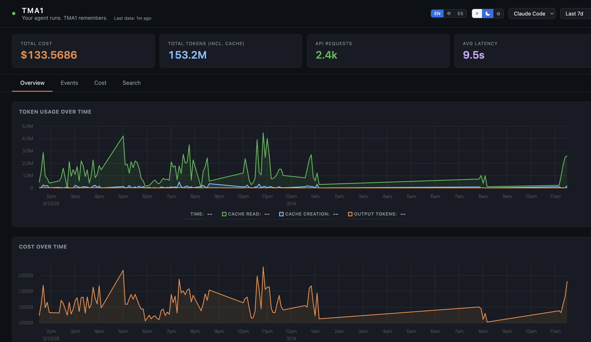
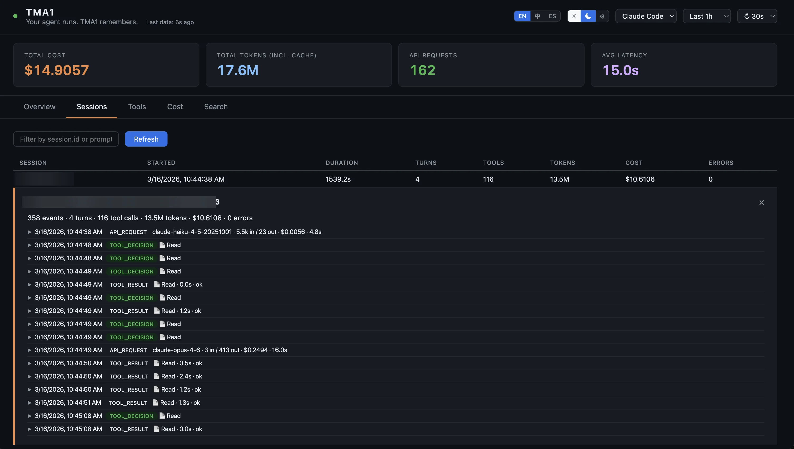
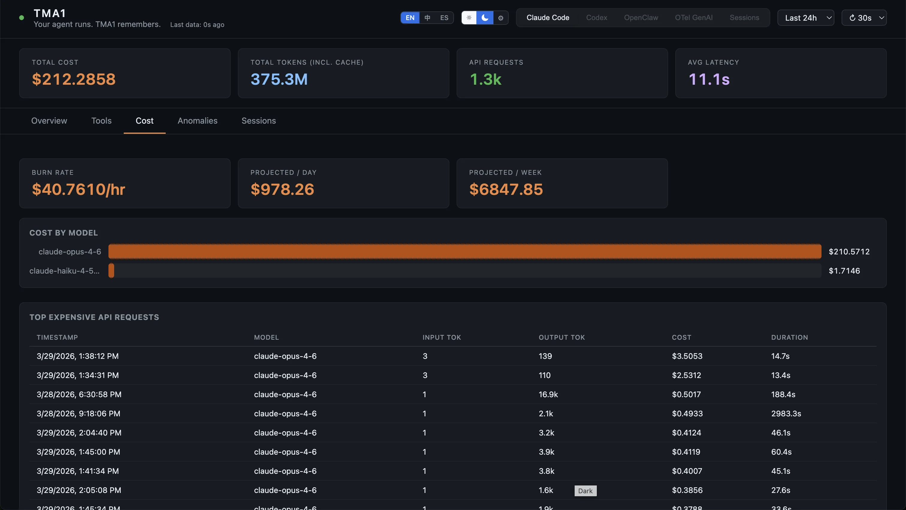

# TMA1

> *"Your agent runs. TMA1 remembers."*

Local-first observability for AI agents, with a built-in dashboard.
See what your agents cost, how long they take, and whether they're doing anything weird. All data stays on your machine.
One binary, no cloud account, no Docker, no Grafana.

Named after TMA-1 (Tycho Magnetic Anomaly-1) from *2001: A Space Odyssey*:
the monolith buried on the moon, silently recording everything until you dig it out.



## What's in it

Six dashboard views, picked automatically from whatever data shows up:

| View | Tabs | Data Source |
|------|------|-------------|
| **Claude Code** | Overview, Tools, Cost, Anomalies, Sessions→ | OTel metrics + logs |
| **Codex** | Overview, Tools, Cost, Anomalies, Sessions→ | OTel logs + metrics |
| **OpenClaw** | Overview, Sessions, Traces, Cost, Security | OTel traces + metrics |
| **OTel GenAI** | Overview, Traces, Cost, Security, Search | OTel traces (gen_ai semantic conventions) |
| **Sessions** | Sessions, Search | Hooks + JSONL transcripts (Claude Code, Codex) |
| **Prompts** | Overview, Prompts, Patterns | Heuristic scoring + optional LLM-as-judge |

Sessions→ links in Claude Code and Codex views navigate to the unified Sessions view.

Each view gives you:
- Token counts, cost, and burn rate per model
- p50/p95 latency per model
- Activity heatmap over time
- Anomalies tab that flags expensive requests, errors, and slow tools
- Session replay with full conversation timeline
- Search across all sessions by keyword
- Prompt evaluation with heuristic scoring and optional LLM-as-judge
- SQL access on port 14002, or the built-in query API
- Settings panel to configure LLM API key and server options at runtime

OpenClaw and OTel GenAI views also have a Security tab (shell commands, prompt injection, webhook errors).





## Quick Install

```bash
# macOS / Linux
curl -fsSL https://tma1.ai/install.sh | bash

# Windows (PowerShell)
irm https://tma1.ai/install.ps1 | iex
```

Or build from source:

```bash
git clone https://github.com/tma1-ai/tma1.git
cd tma1
make build
```

## Agent Install

Ask your agent:

> Read https://tma1.ai/SKILL.md and follow the instructions to install and configure TMA1 for your AI agent

## Quick Start

```bash
# Start TMA1
tma1-server

# Configure your agent to send OTel data (protobuf required):

# Claude Code — add to ~/.claude/settings.json:
#   "env": {
#     "OTEL_EXPORTER_OTLP_ENDPOINT": "http://localhost:14318/v1/otlp",
#     "OTEL_EXPORTER_OTLP_PROTOCOL": "http/protobuf",
#     "OTEL_METRICS_EXPORTER": "otlp",
#     "OTEL_LOGS_EXPORTER": "otlp"
#   }

# OpenClaw (sends traces)
openclaw config set diagnostics.otel.endpoint http://localhost:14318/v1/otlp

# Codex — add to ~/.codex/config.toml:
#   [otel]
#   log_user_prompt = true
#
#   [otel.exporter.otlp-http]
#   endpoint = "http://localhost:14318/v1/logs"
#   protocol = "binary"
#
#   [otel.trace_exporter.otlp-http]
#   endpoint = "http://localhost:14318/v1/traces"
#   protocol = "binary"
#
#   [otel.metrics_exporter.otlp-http]
#   endpoint = "http://localhost:14318/v1/metrics"
#   protocol = "binary"
#
#   Then restart Codex.

# Any OTel SDK
OTEL_EXPORTER_OTLP_ENDPOINT=http://localhost:14318/v1/otlp \
OTEL_EXPORTER_OTLP_PROTOCOL=http/protobuf \
your-agent

# Open the dashboard
open http://localhost:14318
```

## How It Works

```
Agent (Claude Code / Codex / OpenClaw / any GenAI app)
    │  OTLP/HTTP
    ▼
tma1-server  (port 14318)
    │  receives + stores OTel data
    │  derives per-minute aggregations
    │  serves dashboard UI
    ▼
Browser dashboard (embedded in the binary)
```

One process, one binary. First start creates `~/.tma1/` and you're good to go. By default, nothing leaves your machine. If you enable optional LLM prompt evaluation (via Settings or `TMA1_LLM_API_KEY`), prompt content is sent to the configured provider (Anthropic/OpenAI) for scoring.

Settings configured in the dashboard are saved to `~/.tma1/settings.json`. Environment variables always take priority over the settings file.

## OTLP Endpoints

Agents send OTLP data to tma1-server:

```text
http://localhost:14318/v1/otlp          # Wildcard OTLP (recommended)
http://localhost:14318/v1/traces        # Direct signal: traces
http://localhost:14318/v1/metrics       # Direct signal: metrics
http://localhost:14318/v1/logs          # Direct signal: logs
```

Codex requires separate per-signal endpoints; other agents can use the single `/v1/otlp` base.

## API Endpoints

| Endpoint | Method | Description |
|----------|--------|-------------|
| `/health` | GET | Liveness check |
| `/status` | GET | Backend reachability |
| `/api/query` | POST | SQL proxy (`{"sql": "SELECT ..."}`) |
| `/api/prom/*` | GET/POST | Prometheus API proxy (PromQL) |
| `/api/evaluate` | GET/POST | LLM prompt evaluation (availability check / single prompt) |
| `/api/evaluate/summary` | POST | LLM batch summary (sampled prompts) |
| `/api/settings` | GET/POST | Read/write server settings (LLM config, log level, TTL) |

## Configuration

| Variable | Default | Description |
|----------|---------|-------------|
| `TMA1_HOST` | `127.0.0.1` | Address tma1-server binds to |
| `TMA1_PORT` | `14318` | HTTP port for tma1-server |
| `TMA1_DATA_DIR` | `~/.tma1` | Local data and binary directory |
| `TMA1_GREPTIMEDB_VERSION` | `latest` | GreptimeDB version to download |
| `TMA1_GREPTIMEDB_HTTP_PORT` | `14000` | GreptimeDB HTTP API + OTLP port |
| `TMA1_GREPTIMEDB_GRPC_PORT` | `14001` | GreptimeDB gRPC port |
| `TMA1_GREPTIMEDB_MYSQL_PORT` | `14002` | GreptimeDB MySQL protocol port |
| `TMA1_LOG_LEVEL` | `info` | Log level: debug/info/warn/error |
| `TMA1_DATA_TTL` | `60d` | Default TTL for auto-created tables |
| `TMA1_LLM_API_KEY` | (empty) | API key for LLM provider (enables prompt evaluation) |
| `TMA1_LLM_PROVIDER` | `anthropic` | LLM provider: `anthropic` or `openai` |
| `TMA1_LLM_MODEL` | (auto) | Model override for LLM evaluation |

## Development

```bash
make build           # Build the binary → server/bin/tma1-server
make build-linux     # Cross-compile for Linux amd64
make build-windows   # Cross-compile for Windows amd64
make vet             # Run go vet
make lint            # Run golangci-lint (requires golangci-lint v2)
make lint-js         # Run ESLint on dashboard JS (requires Node.js)
make test            # Run tests with race detector
make clean           # Remove built binaries
make run             # Build and run locally
make dev             # Watch mode: rebuild + restart on file changes (requires fswatch)
```

## License

Apache-2.0
